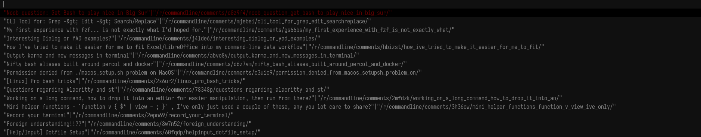

# srsearch

Search subreddit using dmenu.

Note: In cases where input is not required, `fzf` or `rofi` can be used.

## Dependencies
- jq
- dmenu
- xclip
- curl

## How to use
- run script with either `clipboard` or `browser` argument.
- type a subreddit to search, _e.g commandline_.
- type in search term, _e.g bash is cool_.
- you'll see results in a dmenu window. Pressing enter will either copy result link to clipboard or open link in your browser (requires `$BROWSER` environment variable).

## TODO
- [ ] results limit
- [x] loop through results
- [x] choose what to do with results
